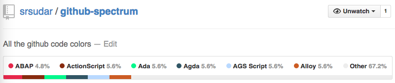

# github-spectrum

> All the colors!

All the supported github color codes.

Github measures this by characters in source files. The target is 160, for no
particular reason.

Use
[this](https://github.com/github/linguist/blob/master/lib/linguist/languages.yml)
yaml file for extensions.

So sad. Github supports only six colors. With each new language, the gray
expands, squashing the color out of the world.

And yet it grows.

# 20 Languages in.

20 files in 20 languages. Each has 180 characters, and yet the number it is
displaying don't add up. A bug in the coloring or computation logic, perhaps?
Abap definitely has the same number of characters as ActionScript, as a simple
test.

