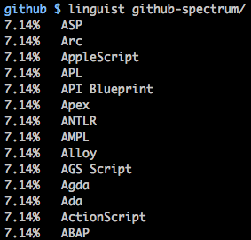
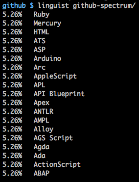
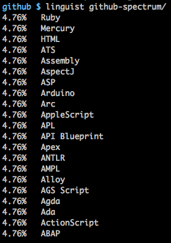

# github-spectrum

At home made [Mario Batali's Penne
all'Arrabbiata](https://cooking.nytimes.com/recipes/1015236-mario-batalis-penne-allarrabbiata).
I added a few modifications of my own based on the comments.

> How now
> Brown cow
> How now
> Oh I'm sorry you're a goat

> All the colors!

All the supported github color codes.

Github measures this by characters in source files. The target is 160, for no
particular reason.

Use
[this](https://github.com/github/linguist/blob/master/lib/linguist/languages.yml)
yaml file for extensions.

So sad. Github supports only six colors. With each new language, the gray
expands, squashing the color out of the world.

And yet it grows.

# Snapshots

Here are Snapshots of the repo as it grows. Output from
[linguist](https://github.com/github/linguist) is shown when the numbers on
github don't match the numbers shown by github.

Only those languages that are shown by linguist (i.e. not things like ant.xml
or ApacheConf, which are shown in the linguist yaml as `data` and `markup`,
respectively.

## 1

## 2

## 3

## 4

## 5

## 6

## 7

## 8

## 9

## 10

## 11

## 12

## 13

## 14

## 15

## 16

## 17

## 18

## 19

## 20

## 21

## 22

## 23

